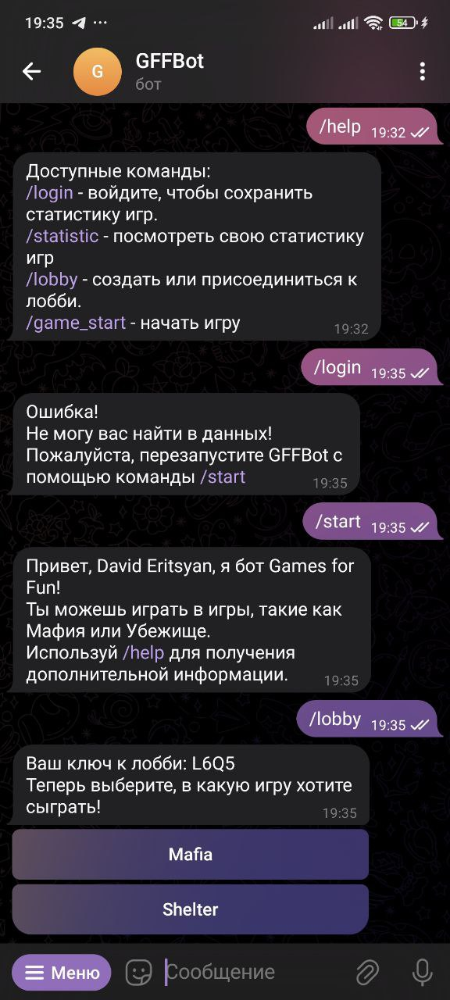
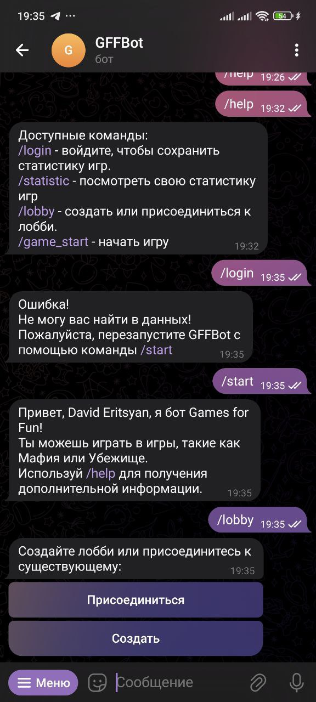
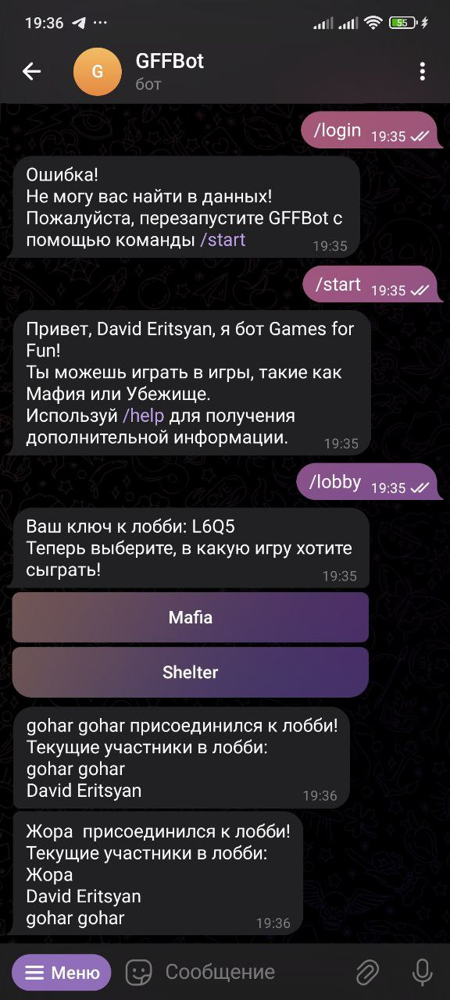
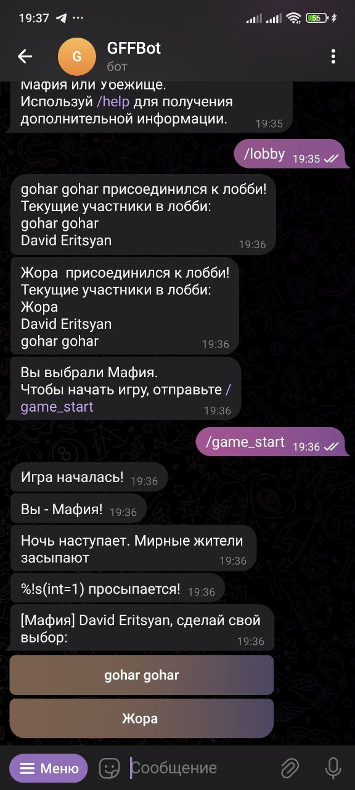
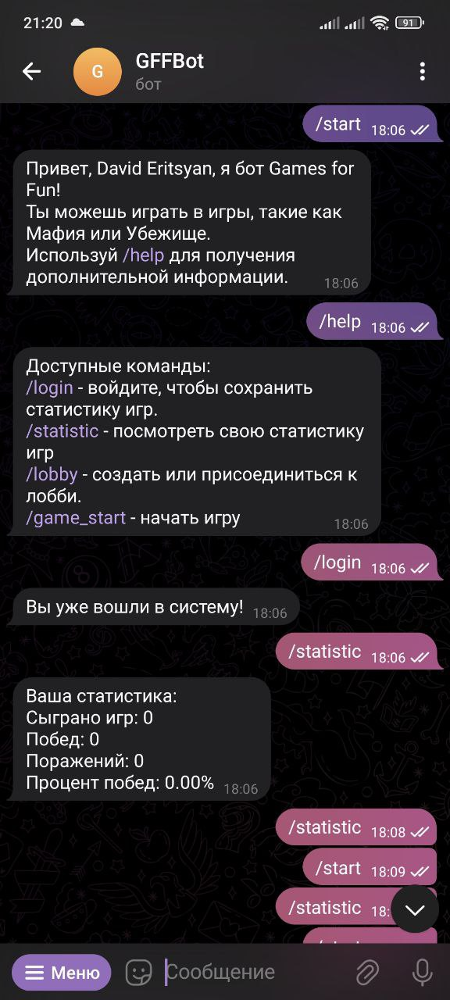
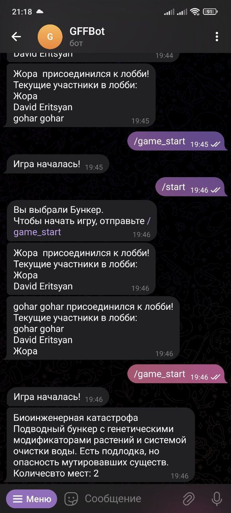

# Telegram-бот для игры в "Мафию" и "Бункер" (на Go)

GFF - это бот, который позволяет играть с друзьями в **"Мафию"** и **"Бункер"** прямо в Telegram. Он автоматически управляет регистрацией игроков, назначением ролей, фазами игры и завершением партий.

Я разработал этот проект, чтобы прокачать навыки в:

- Go и работе с горутинами
- Базах данных (PostgreSQL)

---

## Поддерживаемые игры

### Мафия

- Игроки: 5–10
- Роли: мафия, комиссар, доктор, мирные
- Ночные действия, обсуждение и голосование
- Победные условия и завершение игры

### Бункер

- Постапокалиптический сценарий: случайный катаклизм, убежище на ограниченное число человек
- Игроки получают случайные характеристики (профессия, здоровье, багаж, хобби и т.д.)
- Обсуждение и голосование: кто достоин попасть в бункер
- Игра заканчивается, когда остаются только нужные по количеству

---

## Возможности

- Мультипользовательский режим (группы)
- Случайная генерация ролей/параметров
- Общение и взаимодействие через Telegram
- Хранение статистики в PostgreSQL
- Несколько параллельных действий (через горутины)

---

## 🛠 Технологии

| Технология         | Назначение                        |
|--------------------|-----------------------------------|
| **Go**             | Основная логика, многопоточность  |
| **PostgreSQL**         | Хранение игроков и статистики         |
| **Telegram API**   | Взаимодействие с пользователями   |

---

## Скриншоты

---

## 📜 Лицензия

Проект распространяется под лицензией **MIT**. См. файл [LICENSE](./LICENSE).
